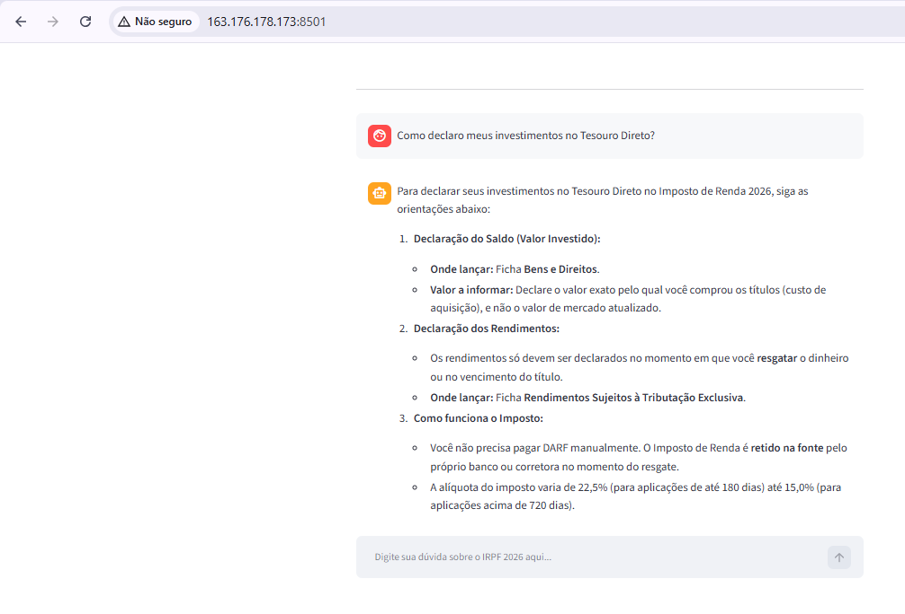

# 📊 Agente Inteligente - Imposto de Renda 2026

## 📝 Descrição do Projeto
Este projeto consiste em um Agente Inteligente especialista na legislação do Imposto de Renda Pessoa Física (IRPF Exercício 2026 / Ano-calendário 2025). Utilizando a arquitetura **RAG (Retrieval-Augmented Generation)**, o agente interpreta perguntas complexas em linguagem natural e responde baseando-se estritamente nas bases de dados oficiais fornecidas em PDF e CSV, eliminando totalmente o risco de alucinações de IA.

Desenvolvido como solução para o **Challenge Alura Agente** dentro do programa Oracle Next Education (ONE) em parceria com a Alura.

## 🚀 Link da Aplicação na Nuvem
> 🌐 **Acesse o sistema online:** `http://163.176.178.173:8501`

## 📐 Engenharia de Dados e Estratégia Anti-Alucinação
Para garantir respostas matemáticas exatas e **evitar que a IA delire ou invente regras**, o projeto implementa uma diretriz rígida de segurança:
1. **Filtro de Escopo Sistêmico:** Através do parâmetro `system_instruction` combinado com uma temperatura baixa (`0.1`), o cérebro da IA foi bloqueado para atuar **apenas** sobre os arquivos locais. Se receber perguntas fora do escopo tributário, o Agente recusará o atendimento de forma segura [📄].
2. **Dados Estruturados Ocultos:** Os dados cruciais de investimentos (Bolsa, Day Trade, CDB, Criptomoedas), a tabela progressiva anual e a comparação de modelos foram extraídos para matrizes `.csv` e `.pdf` leves, processados nativamente pelo Python para poupar cota e garantir exatidão de cálculo [📄].

## 🛠️ Tecnologias Utilizadas
* **Linguagem Principal:** Python 3.11+
* **Interface Web:** Streamlit
* **Processamento de Documentos:** PyPDF
* **Orquestração de IA:** Google GenAI SDK (Modelo: `gemini-3.6-flash`)
* **Infraestrutura e Nuvem:** Oracle Cloud Infrastructure (OCI) - Instância Compute VM.Standard.E4.Micro (Always Free)

## 📦 Estrutura de Arquivos do Repositório
* `app.py`: Código-fonte principal da interface e orquestração do Agente.
* `Guia_Rapido_IRPF_2026.pdf`: Guia compilado com regras fundamentais de financiamentos, dependentes e obrigatoriedades [📄].
* `Tabela_IRPF_2026.csv`: Tabela progressiva anual de salários e alíquotas.
* `Tabela_Investimentos_2026.csv`: Regras tributárias para ativos financeiros.
* `Tabela_compara_compl_simpl_IRPF2026.csv`: Matriz comparativa entre os modelos Completo e Simplificado.
* `requirements.txt`: Dependências de instalação do sistema.
* `.gitignore`: Filtro de exclusão de arquivos de sistema (como arquivos de cache e chaves SSH privadas).

## 📸 Guia de Prompts para Testes (Comportamento Real do Agente)

Sugerimos que a banca avaliadora realize os seguintes prompts de teste para comprovar o funcionamento estável do sistema:

* **Teste 1 - Raciocínio Lógico-Matemático e Cenários de Imposto:**
  * *Prompt:* "recebo salario de 6 mil reais mensais, quanto devo pagar de imposto?"
  * *Resposta Real:* O agente calculará a renda anual (R$ 72.000,00), apresentará o cenário bruto (R$ 8.946,22 devido) e o cenário simplificado com desconto de 20% (R$ 4.986,22 devido), exibindo as equações de forma limpa.
* **Teste 2 - Consulta de Regras de Ativos (CSV de Investimentos):**
  * *Prompt:* "qual é o percentual para day trade?"
  * *Resposta Real:* "A alíquota de imposto de renda para operações de Day Trade (compra e venda no mesmo dia) é de 20% sobre o lucro obtido. Vale lembrar que, para essa modalidade de operação, não existe valor de isenção. O recolhimento do imposto deve ser feito mensalmente por meio de DARF até o último dia útil do mês seguinte..."
* **Teste 3 - Proteção de Escopo (Bloqueio Total contra Delírios):**
  * *Prompt:* "quem venceu a copa de 2026?"
  * *Resposta Real:* O agente barrará o assunto imediatamente devolvendo a frase exata de segurança: **"Não localizei essa informação nos manuais oficiais."** [📄] Isso comprova a resiliência e a blindagem da nossa janela de contexto contra alucinações.
## 📸 Demonstração do Funcionamento

